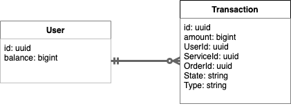

## Balance App

This document and openapi file are still in "work in progress" state.

## About

A balance API written in Golang using **Gin** as the main framework, **gorm** as ORM, and **Postgres** as the primary DB.

The app manages User balance through Transaction instances.



**Transactions** could be of two types:

- **Withdrawals**
  - **Lifecycle** begins with _Freezing_ given amount of money on the user's balance.
  - After _Freezing_, the transaction could be either _Reverted_ (fully deleted from a DB, with money returned to the user's balance) or _Applied_ (transaction is now available for analytics and could not be reverted).
- **Deposits**

## Setup and run

All the following instructions are for Unix based systems.
For Windows, commands might slightly diverse.

### Requirements

To start the app as the docker container you need to have `docker` and `docker-compose` installed.

`local.env` file already contains all the necessary environment variables to run DB and HOST.You can change them if needed, but make sure to sync up changes with docker compose file.

- I used `docker-compose` version `v2.12.0` and `docker` version `20.10.20`.

To run the container execute the following command:

```bash:
docker compose up
```

To start the app on your local machine you need to have `Golang` and `PostgreSQL` installed.

- I used `Golang` version `1.19.1` and `PostgreSQL` version `14`.

To run app on the local device firstly make sure that **local.env** file contains accurate credentials of your DB, than –– execute the following command:

```bash:
go run ./cmd/api/main.go
```

## API

### Users

`GET http://host/users` - retrieves all users  
Request query params:  
**limit** : int (default 25) - limit of users to retrieve  
**offset** : int (default 0) - offset of users to retrieve

Response example:

```json:
{
  "users": [
    {
      "id": "1",
      "balance": 100,
      "version": 1
    },
    {
      "id": 2,
      "balance": 200,
      "version": 13
    }
    // ...
  ]
}
```

`GET http://host/users/:id` - get user info by id
Response example:

```json:
{
  "user": {
    "id": "1",
    "balance": 100,
    "version": 21
  }
}
```

It's important to notice that methods above serve more debugging purposes than actual usage. "version" field souldn't be exposed to the client.

`GET http://host/users/:id/balance` - get user balance by id
Response example:

```json:
{
  "user_id": "1",
  "balance": 100
}
```

### Transactions

`POST http://host/transactions/deposit` - deposit money to user balance  
Request body example:

```json:
{
  "user_id": "1",
  "amount": 100
}
```

Response example:

```json:
{
  "status": "ok"
}
```

`POST http://host/transactions/freeze` - freeze money for the order within a service on user balance
Request body example:

```json:
{
  "user_id": "1",
  "service_id": "1",
  "order_id": "1",
  "amount": 100
}
```

Response example:

```json:
{
  "status": "ok"
}
```

`POST http://host/transactions/apply` - apply frozen transaction  
Request body example:

```json:
{
  "user_id": "1",
  "service_id": "1",
  "order_id": "1",
  "amount": 100
}
```

Response example:

```json:
{
  "status": "ok"
}
```

`POST http://host/transactions/revert` - reverts frozen transaction  
Request body example:

```json:
{
  "user_id": "1",
  "service_id": "1",
  "order_id": "1",
  "amount": 100
}
```

Response example:

```json:
{
  "status": "ok"
}
```

`POST http://host/transactions/stat/:id` - get user transactions  
Request query params:  
**limit** : int (default 25) - limit of transactions to retrieve  
**offset** : int (default 0) - offset of transactions to retrieve  
**sort_by_date_asc** : bool (default false) - sort transactions by date in ascending order  
**sort_by_date_desc** : bool (default false) - sort transactions by date in descending order  
**sort_by_amount_asc** : bool (default false) - sort transactions by amount in ascending order  
**sort_by_amount_desc** : bool (default false) - sort transactions by amount in descending order  
Response examples:

```json
[
  {
    "amount": 100,
    "date": "2012-12-12T12:12:12.12121Z",
    "type": "deposit"
  },
  {
    "amount": 1020,
    "date": "2012-12-12T12:12:12.12121Z",
    "order_id": "2",
    "service_id": "1",
    "state": "FROZEN",
    "type": "withdrawal"
  }
  // ...
]
```

**Important notes:**

- if both asc and desc are set, desc will be used
- if both amount and date are set, amount will be used first

`POST http://host/transactions/services-sum-amount` - exports all applied transactions grouped by service and sum of amount within a given month  
Request query params:  
**month** : int (required, no default) - month to retrieve transactions for  
**year** : int (required, no default) - year to retrieve transactions for

Response example:

```json
{
  "uri": "http://host/csvs/services-stats-2012-12.csv"
}
```

Final csv file name is intentionaly self explanatory, so the analists could easily get data for the needed month if available. The more secure way would be to genrate a random hash and put it into the file name.
